# Báscula de control de peso

El objetivo es documentar la realización una báscula de control de peso didáctica para identificar mediante 4 sensores, diferentes tipos de peso. De esta manera se puede trabajar las competencias de "Electrónica microprogramable" del ciclo de grado superior de "Mantenimiento Electrónico" relacionados con los conocimientos de electrónica combinacional (Puertas lógicas, multiplexores, decodificadores...). Tanto con chips combinacionales así como con FPGAs.

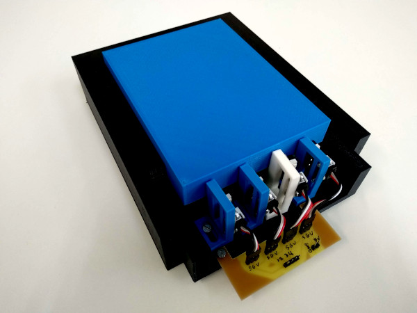

La báscula está compuesta de piezas impresas en 3D que está disponibles en este repositorio, [tanto en STL como en Freecad](./Piezas) para su impresión y modificación. Además es necesario 4 finales de carrera (aunque se podría con menos).

Por otra parte se ha diseñado una pequeña PCB en Kicad para facilitar el cableado del circuito.

## Piezas 3D

|  Nº  |     Archivo     |                         Descripción                          |                 Imagen                 |
| :--: | :-------------: | :----------------------------------------------------------: | :------------------------------------: |
|  1   |      Base       |      Base de báscula para apoyar el peso en la báscula       |         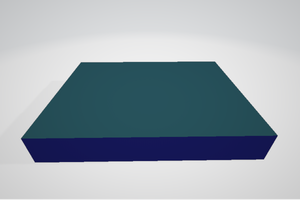          |
|  1   |     Báscula     | Estructura de la báscula donde se sustentan todas las piezas |     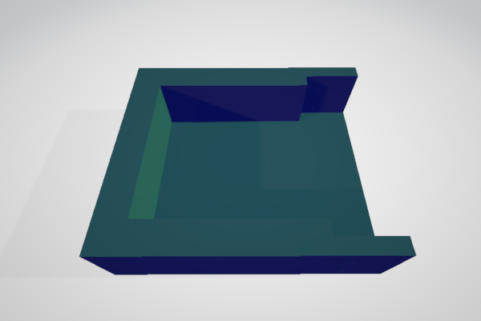      |
|  1   | Báscula Lateral |  Pieza lateral de la báscula al que se apoyan los sensores   | 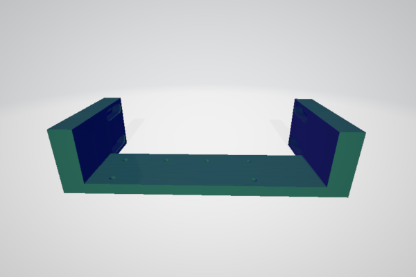 |
|  4   | Báscula sensor  | Pieza donde se ajusta los sensores y se calibran los sensores |  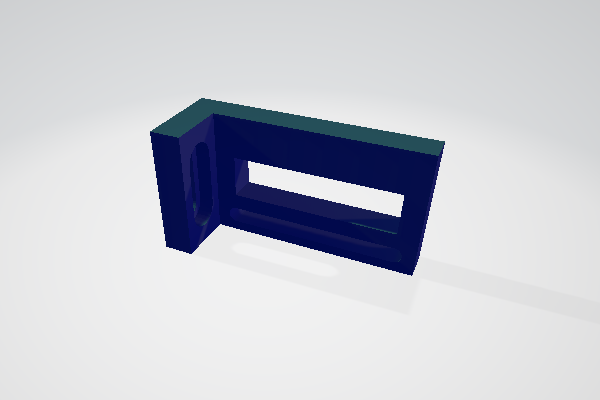  |

## Componentes Mecánicos

|  Nº  |     Nombre      |                         Descripción                          |                            Imagen                            |
| :--: | :-------------: | :----------------------------------------------------------: | :----------------------------------------------------------: |
|  10  | Tornillos M3x6  |           Tornillos métricos philips de acero M3x6           |                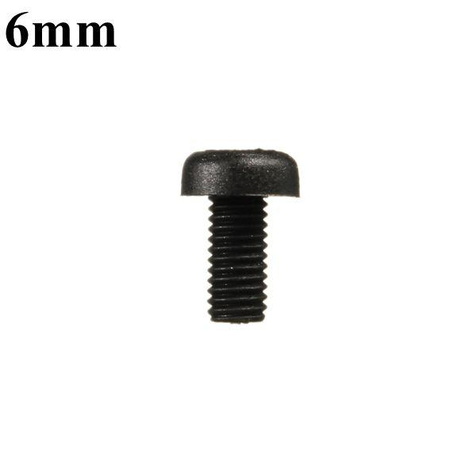                |
|  6   | Tornillos M3x10 |          Tornillos métricos philips de acero M3x10           |                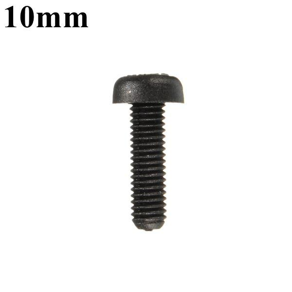                |
|  1   |     Esponja     |              Esponja de dimensiones 11x9,5x2,5               |                                      |
|  4   |    Sensores     | Final de carrera de movimiento ENDSTOP para ramps 1,4 impresora 3D CR-10 CR-10S CR-S4 CR-S |                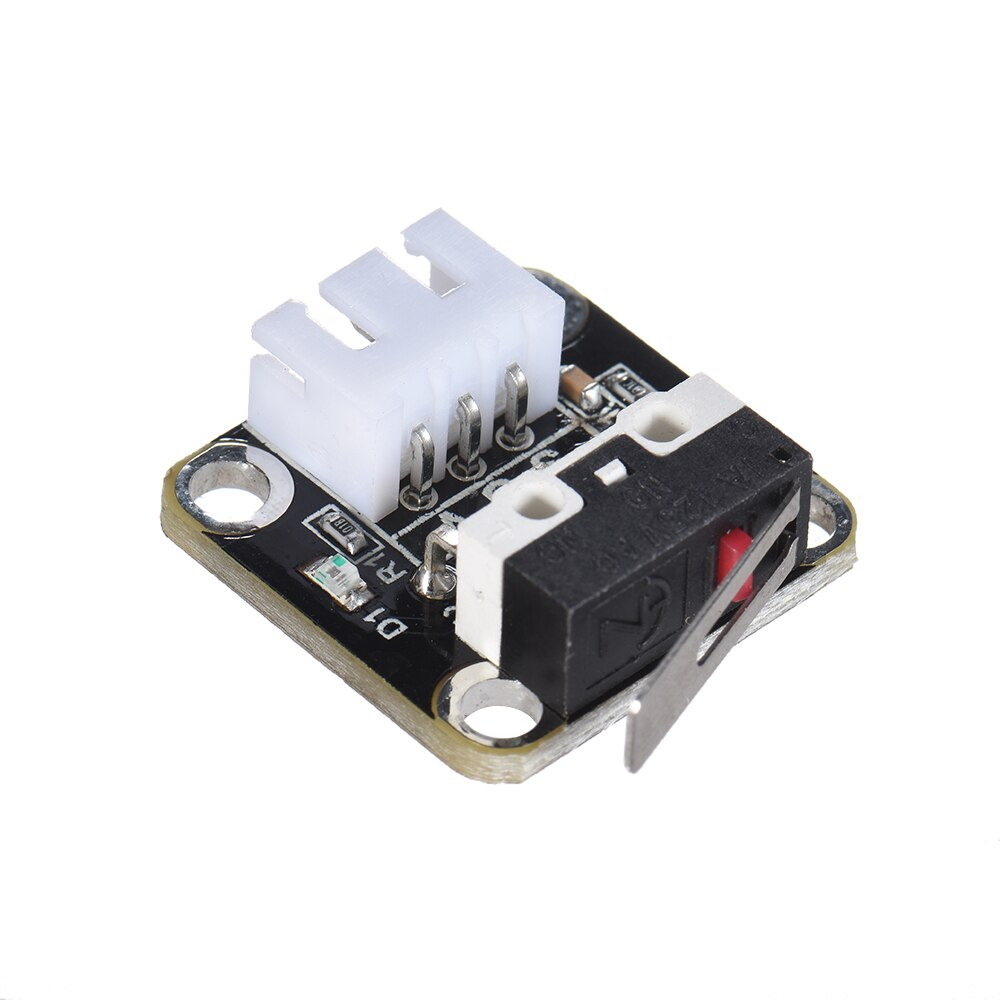                |
|  4   |      Cable      | 3 cables multihilos con conectores para los sensores finales de carrera |                    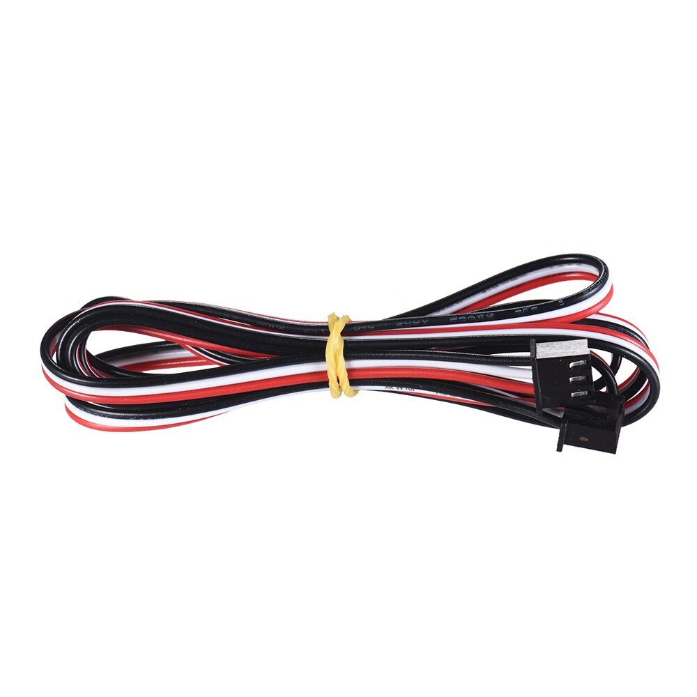                    |
|  1   |       PCB       | PCB del circuito diseñado en [Kicad](./Kicad-PisuPCB), con su [archivo CAM](./Kicad-PisuPCB/PCB_pisua_LPKF.cam) (CircuitCAM) y su [archivo BroadMaster](./Kicad-PisuPCB/PCB_pisua_LPKF.LMD) para mecanizar en la LPKF |  |

## Montaje de la báscula

1. Sobre la pieza impresa en 3D "báscula lateral", atornillamos la PCB con 2 tornillos M3x6
2. Sobre las piezas impresas en 3D "báscula sensor", atornillamos los sensores con 2 tornillos M3x6 por sensor a diferentes alturas cada sensor.
3. Colocamos sobre la pieza "báscula lateral", las piezas impresas en 3D "báscula sensor" mediante tornillos M3x10.
4. Juntamos la "báscula lateral" sobre la pieza impresa en 3D "báscula".
5. Solo queda colocar la esponja y sobre ella la pieza impresa en 3D "base".
6. Tras finalizar el montaje solo queda ajustar cada pieza "báscula sensor" acercándola a la base de manera que permita ser pulsado el sensor por la base.

Fotos del proceso de montaje de la báscula:

|                  1                   |                  2                   |                  3                   |
| :----------------------------------: | :----------------------------------: | :----------------------------------: |
| 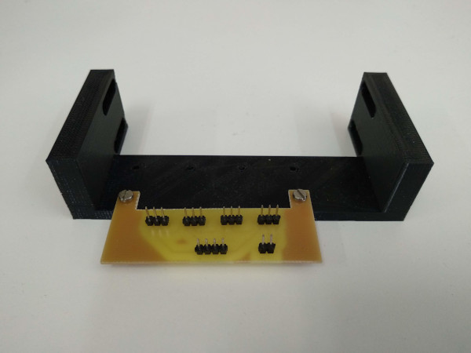 | 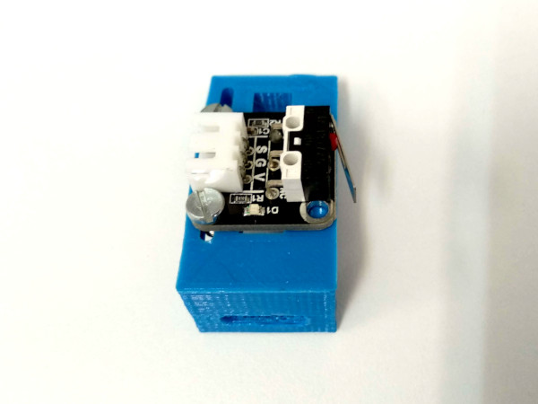 | 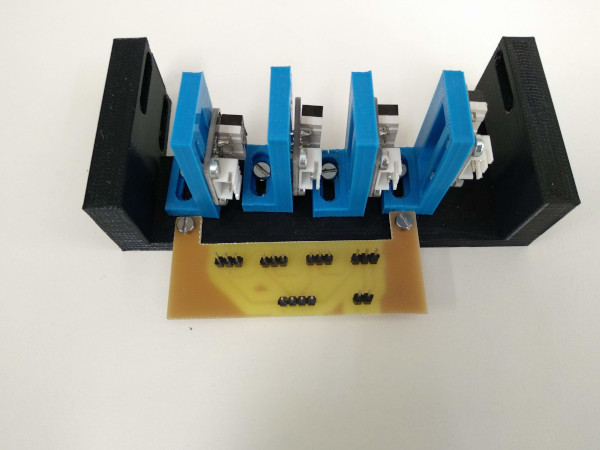 |
|                **4**                 |                **5**                 |                **6**                 |
| 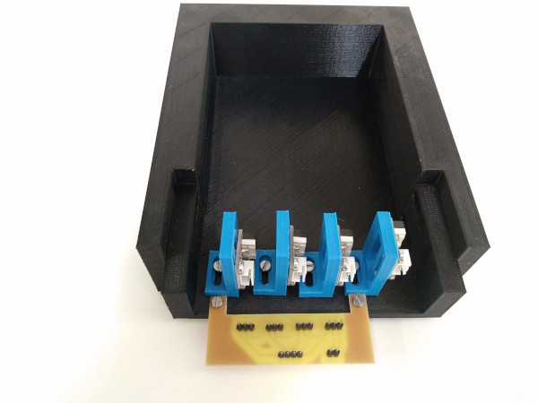 | 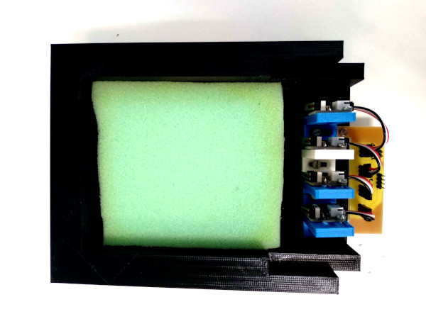 | 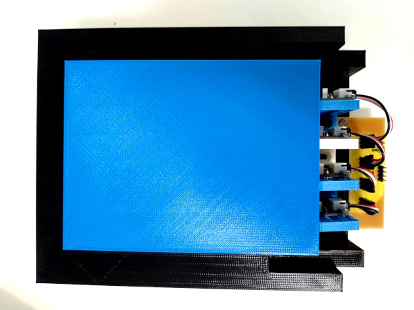 |

* El cableado de los sensores a la PCB, se ha recortado a una medida ajustada y en un extremo se han puesto conectores futaba o JR.
* 

## Funcionamiento eléctrico

Las señales de conexión de los 4 sensores, cuando están sin pulsar los sensores están en alta impedancia (circuitos abiertos ). Al pulsar los sensores la señal de salida del sensor estará conectada a masa. Por este motivo para poder usarse estos sensores se deberá una resistencias en pull-up de 10K ohm por sensor.

No hay que olvidarse de alimentar los 4 sensores, conectandolos a una fuente de alimentación de 5V y GND sus respectivos pines.

Otra posibilidad en vez de montar los pull-up con resistencias fuera, es hacerlo mediante la activación de resistencias internas. En este caso se pueden ver los montajes con resistencias externas y con resistencias internas usando una placa [FPGA libre Alhambra II](https://groups.google.com/forum/#!forum/fpga-wars-explorando-el-lado-libre).

| 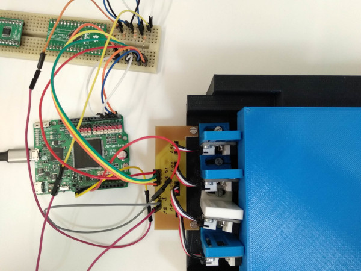 | 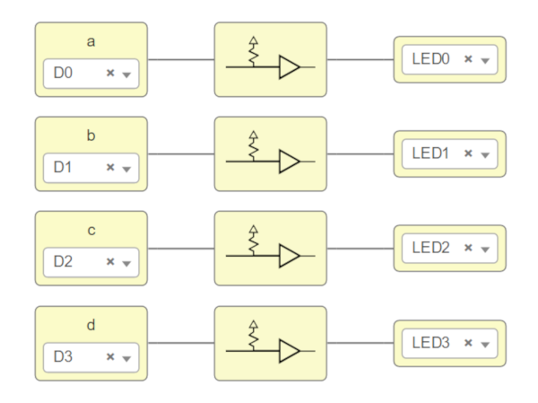     | 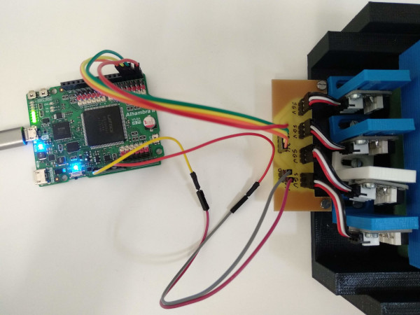 |
| ------------------------------------- | ---------------------------- | ------------------------------------- |
| Circuito con Pull-up ext.             | Programación de Pull-up int. | Circuito con Pull-up int.             |

[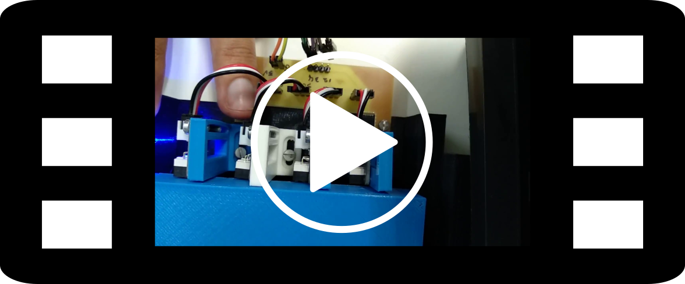](./Fotos/Video_Bascula_Funcionamiento.mp4)

## Mejoras futuras pendientes

Sustituir la espoja por algún sistema amortiguado que se adecue mejor a un funcionamiento real.

Mejorar el sistema mecánico para hacerlo con un diseño más atractivo y más robusto.